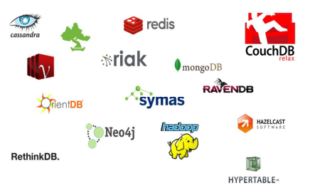

# Course Introduction - February 20th, 2024

## Why opt for Non-Relational Databases?
In an era increasingly driven by technology, the sheer<sub><a id="footnote-1-ref" href=#footnote-1>[1]</a></sub> **volume of data** processed by devices, such as computers, is experiencing **exponential growth**. This prompts a critical question: <strong>why do we need a class of databases that diverges from traditional relational models?</strong>
<br><br>
Given the vast volume of information processed and exchanged by computers in today's world, originating from **diverse sources** and exhibiting **various structures**, there's a compelling need for systems that are fast, reliable, and efficient in handling such diverse datasets.
<br><br>
In such a case, we can use the term <strong>Big Data</strong> to refer to information that contains greater variety arriving in increasing volumes and with ever-higher velocity. In particular, this term refers to datasets whose size is beyond the ability of typical database software tools to capture, store, manage, and analyze. We have, therefore, three dimensions that characterize this class of data:
<ul>
    <li><strong>Variety</strong>, which refers to the diverse types of data that can be encountered. This includes structured data (e.g., databases), unstructured data (e.g., text, images, videos), and semi-structured data (e.g., XML and JSON files).</li>
    <li><strong>Volume</strong>, which represent the sheer size or scale of the data being generated or collected. It refers to the vast amounts of data that exced the capacity of traditional database systems.</li>
    <li><strong>Velocity</strong>, the speed at which data is generated, processed, and made available for analysis. It emphasizes the real-time or near-real-time nature of data streams.</li>
</ul>
The following image shows a diagram comparing **big data** and **normal processing capabilities**. It depicts the vast difference in the amount of data that big data can handle compared to normal processing capacity:
<br><br>
<div style="text-align:center">
  
</div>

## How can we quantify big data?
The **overwhelming volume** of data is a key aspect in big data. Traditionally, datasets on the order of **terabytes (TB)**, **petabytes (PB)**, or even **zettabytes (ZB)**, are considered as falling into the realm of big data.
For comparison purposes, here is the **byte scale**:
- \\(1\ Zettabyte = 2^{70}\ bytes\\)
- \\(1\ Exabyte = 2^{60}\ bytes\\)
- \\(1\ Petabyte = 2^{50}\ bytes\\)
- \\(1\ Terabyte = 2^{40}\ bytes\\)
- \\(1\ Gigabyte = 2^{30}\ bytes\\) 
- \\(1\ Megabyte = 2^{20}\ bytes\\) 
- \\(1\ Kilobyte = 2^{10}\ bytes\\) 
- \\(1\ Byte = 2^{3}\ bits\\) 

These values illustrate the increasing magnitudes of data storage.
The following image shows how the global generation of data increases annually:
<div style="text-align:center">
    
    <p>Reference: <a href="https://explodingtopics.com/blog/data-generated-per-day"> explodingtopics.com (2024)</a></p>
</div>

## What kind of data are we considering?
As mentioned before, data can be classified into three categories:
- **Structured Data** refers to well-organized, tabular data with a clear schema. This includes data stored in relational databases and spreadsheets. Big data applications may involve large volumes of structured data, especially when dealing with historical records, transactional data, or standardized information. <br>
- **Semi-structured Data** is a class of data that has some level of structure, but does not conform to the rigid structure of traditional relational databases. It may have tags, hierarchies, or key-value pairs. JSON and XML are included in this class. Big data applications may leverage semi-structured data formats for flexibility and scalability, such as handling data with varying attributes or evolving schemas. <br>
- **Unstructured Data** is a category of data that lacks a predefined data model or is not organized in a tabular structure. It includes text, images, audio, and video. Big data applications often deal with massive amounts of unstructured data, such as sentiment analysis on social media, image recognition, or natural language processing.

In fact, the following image shows the increasing treatment of unstructured data over structured data, as time goes on:
<div style="text-align:center">
    
    <p>Reference: <a href="https://e.huawei.com/en/articles/storage/2021/all-flash-data-center-green-energy">Huawei GIV (2021)</a></p>
</div>

As for Big Data sources, they comprise **social networks**, **logs of various web/email servers or routers**, **sensor networks**, **IoT devices**.

## Data Processing
In the expansive landscape of big data, efficient data processing is achieved through the orchestration of three key paradigms:
- **OLTP (Online Transaction Processing)**: it's a type of data processing that consists of executing a number of **transactions** occuring **concurrently**, such as **online banking**, **shopping**, **order entry**, or sending **text messages**. These transactions traditionally are referred to as **economic or financial** transactions, recorded and secured so that an enterprise can access the information anytime for **accounting or reporting** issues. In short, it enables the **real-time execution** of large numbers of transactions by large numbers of people;

- **OLAP (Online Analytical Processing)**: it focuses on **complex queries** and **data analysis**. OLAP systems are optimized for **analytical and ad-hoc queries**, involving aggregations, grouping, and multidimensional analysis. They are **read-heavy**, designed for **data warehousing** and **business intelligence** applications, typically using a **denormalized**<sub><a id="footnote-2-ref" href=#footnote-2></a></sub> data model to improve query performance.

- **RTAP (Real-Time Analytics Processing)**: aiming to provide **real-time analytical** capabilities on transactional data, RTAP systems offer **near-real-time analysis** on **streaming or transactional** data. These systems often have a **hybrid architecture** combining elements of OLTP and OLAP, enabling fast and analytical processing on **live data**. RTAP systems are designed to handle **high-velocity data streams** and **scale horizontally**<sub><a id="horizontal-scaling-ref" href=#horizontal-scaling>[3]</a></sub> to accomodate growing data volumes.

## Technologies for Big Data
As of today, we have different means to handle and manage **big data**:
- **Data Management Systems**, i.e. NoSQL databases;
- **Models for distributed programming**, i.e. MapReduce and others;
- **Grid and cloud computing**, e.g AWS;
- **Large-Scale Machine Learning**, e.g. Hadoop, Tensorflow and Pytorch.

This course focuses, as mentioned before and as the book title states, on NoSQL databases. The other cited elements will be treated in the <a href="https://uninsubria.coursecatalogue.cineca.it/insegnamenti/2024/25783/2018/9999/10088?coorte=2023&schemaid=5367">Cloud Computing course</a>, which will be conducted next year by the same lecturer of this course.

## What about RDBMSs? - A brief review of Relational Databases
**RDBMSs** are the **predominant database technology** nowadays. They have been first defined in 1970 by Edgar Codd in **IBM's research labs**. In the relational case, data is modeled as **relations**, representing the cartesian product between two domains:
- an **object** corresponds to a **tuple** composed of attribute values, each of which has its own domain;
- a **table** is a set of objects of the same type;
- different tables and their objects are interconnected via **foreign keys**.

As for the declarative language used, relational databases employ **relational calculus**, which is encompassed in the standardized **SQL query language**.

## What's the value of relational databses?
Relational databases have stood the test of time, becoming **highly standardized**. Many **well-developed technologies** have been built upon them, including the **physical organization** of data, **search indexes**, **query optimization**, and **search operator** implementations. The relational model excels in providing **effective concurrency control** through the implementation of **ACID** rules — ensuring **atomicity**, **consistency**, **isolation**, and **durability** for transactions.

Modern RDBMSs are also **seamlessly integrated** with diverse technologies, including programming languages. In conclusion, the relational model is **well-established**, **mature**, and enjoys **extensive support**.

## The trends & requirements of database systems
The trends and requirements of database systems are being driven by the **increasing volume**, **velocity**, and **variety** of data. Traditional relational databases are **struggling** to keep up with these demands, and new types of databases, such as **graph databases** and **NoSQL databases**, are emerging to meet the challenge.

- **Cloud computing** is a major trend in database systems, as it allows organizations to scale their databases up or down as needed and to avoid the costs of managing their own hardware and software.

- **Real database scalability** is essential for handling ever-growing data volumes. Massively distributed systems and horizontally scaling systems are two approaches to achieving real database scalability.

- **Dynamic resource management** is another important requirement for database systems, as it allows them to efficiently allocate resources based on the current workload.

- **Big users who require massive read throughput**, such as social media applications, are driving the need for databases that can handle a large number of concurrent users.

- **The variety of data** that needs to be stored is also increasing, as organizations collect data from a wider range of sources, including social media, sensors, and the Internet of Things (IoT). This is driving the need for flexible database schemas that can accommodate different data types and structures, such as semi-structured data.

While RDBMS have served well for structured data of a defined nature, they struggle to keep pace with the evolving demands of big data.

- **Rigid schema**: Unlike RDBMS with their fixed schema, big data often requires flexibility to accommodate diverse and evolving data structures. This inflexibility in RDBMS can become a major roadblock.

- **Query complexity**: The process of normalizing data in RDBMS, while ensuring data integrity, can lead to intricate queries involving joins across various tables. These complex queries become sluggish when dealing with massive datasets, hindering the real-time performance big data applications often require.

- **ACID transactions**: Designed to maintain data integrity in smaller datasets, the ACID guarantees offered by RDBMS transactions become a burden in a distributed big data environment. This translates to significant processing slowdowns.

As a result, big data solutions increasingly move towards alternative storage options like NoSQL databases or graph databases. These options offer greater flexibility and faster performance when handling the unique challenges of big data, allowing organizations to unlock its full potential.

## The NoSQL class
The term **NoSQL** emerged in the late 90s, initially coined by **Carlo Strozzi** to describe a different type of technology. Originally interpreted as **Not Only SQL**, it hinted at a **departure** from the rigid structures of **traditional relational databases** (RDBMS). However, the term **lacks a precise definition**, and its accidental nature was acknowledged when it first surfaced at an informal meetup in San Francisco in 2009. <br>

**NoSQL databases** are described as **next-generation**, **non-relational**, **distributed**, **open-source**, and **horizontally scalable** solutions. Common characteristics include being **schema-free**, supporting **easy replication**, having a **simple API**, offering eventual **consistency** (BASE - not ACID), and accommodating vast amounts of data. Despite the ambiguous origins of the term, it now commonly signifies **Not only SQL**.

**Is it just another temporary trend?** Various trends, such as **object databases** and **XML databases**, have surfaced before, but NoSQL databases distinguish themselves by **addressing real, practical problems** faced by major companies. These solutions often originate from significant industry players outside academia, drawing on solid theoretical foundations, particularly in distributed processing.

NoSQL databases are widely used, providing a solution to the **impedance mismatch**<sub><a>[4]</a></sub> of RDBMS. They offer a response to the challenge of saving **complex data structures** in databases, such as the example of a programming language user object, where traditional approaches like object-oriented databases and object-relational mapping frameworks have faced limitations or faded into obscurity.

## Impedance mismatch
The **impedance mismatch** refers to the **disparity between the way data is represented in two different environments**, particularly evident in the contrast between the representation of data in a programming language and a relational database.

In the context of a **programming language**, data may be structured within objects, and to store or transfer this data, it often needs to be **converted** into a format suitable for storage or transmission, such as **JSON** or **XML**. This serialization process introduces a potential mismatch when attempting to interact with a relational database.

**Relational databases**, on the other hand, represent data in the form of tuples or tables. This representation is **fundamentally different** from the object-oriented structure commonly found in programming languages. As a result, **transitioning data** between these two environments can be challenging due to the inherent mismatch in their data models.

For example, how do I save the following **user** object in a database?<sub><a id="impedance-mismatch" href=#impedance-mismatch-ref>[4]</a></sub>

```json
    { "id" : 1234,
        "name" : {

        "first" : "foo",
        "last" : "bar"

        },
    "topics": [ "skating", "music"]
    }
```

**NoSQL databases** address the impedance mismatch by providing a **more flexible** and **adaptable** approach to data representation. They commonly use formats like JSON, which is not only a natural fit for representing complex data structures but is also widely compatible with various programming languages. This compatibility helps bridge the gap between the data representation in the application layer and the storage layer, mitigating the impedance mismatch problem encountered in traditional relational databases.

## NoSQL Datastores
The NoSQL ecosystem comprises over 220 databases, categorized into several families:
- Key-value stores;
- Document stores;
- Wide column stores;
- Graph databases.

<div style="text-align:center">
    
    <p>Some NoSQL databases.</p>
</div>

The **diversity** in these families reflects the adaptability of NoSQL databases to different data storage and retrieval requirements. To check the ranking of DBMSs, refer to this <a href="https://db-engines.com/en/ranking">website</a>.

## NoSQL Properties in more detail
As noted before, NoSQL databases boast **distinct features** that redefine **data management practices**, emphasizing adaptability, efficiency, and cost-effectiveness.

1. **Flexible Scalability**:<br>
NoSQL databases prioritize horizontal scalability, opting for distributed systems that add servers or nodes to accommodate increased capacity and performance. This horizontal scaling approach stands in contrast to vertical scalability, which involves adding resources to a single server. The emphasis on horizontal scalability enables NoSQL databases to seamlessly manage growing data volumes and escalating workloads.

2. **Dynamic Schema of Data**:<br>
A standout feature of NoSQL databases is the dynamic schema of data. Unlike traditional relational databases with rigid, predefined structures, NoSQL databases offer varying levels of flexibility. Each type of NoSQL database presents unique approaches to schema design, catering to diverse application needs. This adaptability proves particularly advantageous in scenarios where data structures evolve or exhibit significant variations across different segments of the database.

3. **Efficient Reading**:<br>
Efficiency in reading operations is a paramount focus for NoSQL databases. While investing more time in data storage, these databases optimize read speed by strategically organizing relevant information. This minimizes the need for complex joins or extensive processing during retrieval, making NoSQL databases well-suited for applications with high read-intensive workloads.

4. **Cost Saving**:<br>
Designed with cost-saving principles, NoSQL databases operate efficiently on commodity hardware. This is a departure from traditional relational databases that often necessitate expensive, high-performance infrastructure for optimal operation. The cost-saving aspect is further bolstered by the widespread adoption of open-source models in NoSQL databases. Many NoSQL systems are available as open-source software, delivering cost-effective solutions without compromising performance or scalability. This openness encourages collaborative development and ensures accessibility within a broader community of users.


## The challenges of NoSQL databases

Nonetheless, an increasing number of companies are embracing NoSQL databases, acknowledging their strengths despite certain weaknesses. NoSQL technologies are frequently employed as **secondary databases** for specific **data processing** needs. For examples of companies using NoSQL databases, refer to the following links:
- <a href="https://www.mongodb.com/who-uses-mongodb">Who uses mongodb</a>
- <a href="http://neo4j.com/customers/">Neo4j - customers</a>

So, **does the rise of NoSQL databases signal the end of relational databases?** Not necessarily. The relational model remains ideal for applications requiring structured data and continues to be the predominant model. Therefore, adopting a **polyglot persistence approach** is feasible, where different data stores are used in different circumstances. Two **prevailing trends** are noteworthy:
- NoSQL databases incorporating relational features.
- RDBMSs are integrating NoSQL principles.

## Data models in the NoSQL family
A data model serves as an abstract representation that defines and organizes the structure and relationships of data, acting as a blueprint for how data elements are stored and retrieved within a system.

NoSQL databases come in various forms, each with its own data model:
- **Document stores**: Data is stored as self-contained documents, similar to JSON or XML files, allowing for flexible schema and easy integration of diverse data structures.
- **Key-value stores**: Data is stored as key-value pairs, offering fast retrieval based on the unique key.
- **Wide-column stores**: Data is stored in column families, where each column can have different properties and data types.
- **Graph databases**: Data is represented as nodes and edges, allowing efficient modeling of relationships between entities.


## Aggregate orientation
In the realm of **data management**, traditional **Relational Database Management Systems (RDBMS)** operate on individual **tuples**, producing results in a **tuple format**. However, the evolving needs of modern applications demand a more **sophisticated approach** to handling data, one that goes beyond the **constraints** of individual tuples.

This shift in perspective is encapsulated in the concept of **aggregate orientation**. In contemporary applications and **NoSQL databases**, data is treated as **cohesive units or aggregates** rather than isolated tuples. **Aggregate orientation** signifies a paradigm where **complex and multifaceted** data is viewed and managed as integrated entities, recognizing the intricate relationships within datasets.

This approach acknowledges that real-world data often comes in **complex structures** that are better represented and processed as cohesive entities. **Aggregates**, in this context, become the **building blocks**, offering a more **flexible** and holistic way to manage data. This concept finds resonance across various NoSQL database types, including **key-value**, **wide-column**, and **document-oriented** datastores, where the handling of aggregates aligns with the diverse and dynamic nature of modern data.

## Design strategy
When it comes to designing databases, there's **no one-size-fits-all solution**. The optimal approach depends entirely on **how you intend to manipulate data**. Here, we explore a design strategy that offers flexibility and efficiency in different scenarios.

There is **no universal answer** to the question of **database design**. It hinges entirely on the nature of data manipulation required for a particular application. However, a thoughtful strategy can enhance performance and meet specific application needs.

In designing a database, **two common solutions** often arise:

1. **Accesses to a Single Order at a Time**: Optimal for scenarios where detailed information about individual orders is frequently required.

2. **Accesses to Customers with All Orders**: Suitable for applications that demand comprehensive access to customer information along with their associated orders.

The **choice between the two solutions** is often context-specific. Some applications may lean towards one approach over the other, even within the confines of a single system. The key is to align the design strategy with the specific requirements and patterns of data usage within the application.

An **alternative design strategy** revolves around adopting an aggregate-oriented approach. This involves grouping related data together to be manipulated as a cohesive unit. Here are the pros and cons of this strategy:
- **Pros**
    - **Cluster Efficiency**: Aggregate-oriented design aligns well with running on a cluster. Grouping data together ensures that it resides on the same node, facilitating efficient manipulation.
- **Cons**
    - **Selective Interactions**: While an aggregate structure may optimize certain data interactions, it can pose challenges for others. The cohesive nature of aggregates may be advantageous in specific scenarios but could be an obstacle in situations where more granular access to data is required.

In conclusion, the choice between different design strategies involves careful consideration of the specific needs of the application, balancing advantages and disadvantages to achieve optimal performance and functionality.

## Notes
<p id="footnote-1"><a href=#footnote-1-ref>[1]</a> With the term <b>sheer</b> we're emphasizing the <b>magnitude</b>, the <b>size of the data</b>, without introducing qualifiers or restrictions.

<p id="footnote-2"><a href=#footnote-2-ref>[2]</a> In a <b>normalized</b> data model, data is organized to <b>reduce redundancy</b> and <b>improve data integrity</b>. This is achieved by breaking down data into tables and establishing relationships between the two, which can involve splitting the data into separate tables and linking them with foreign keys. On the other hand, a <b>denormalized</b> data model involves combining tables and information to <b>simplify queries</b> and <b>increase read performance</b>. This means that <b>redundant data</b> may be stored in multiple places to <b>avoid joins and increase query speed</b>. While this can improve query performance, it may <b>sacrifice</b> some aspects of data integrity and can lead to data redundancy.</p>

<p id="horizontal-scaling"><a href="#horizontal-scaling-ref">[3]</a> <b>Horizontal scaling</b>, <b>or scale-out</b>, is a method of <b>increasing system capacity</b> by <b>adding more independent machines or nodes</b> to <b>distribute and handle workloads</b>. This approach <b>enhances redundancy</b>, offers <b>linear scalability</b>, and is <b>cost-effective</b>, commonly facilitated by cloud computing and containerization technologies. <b>Challenges</b> include ensuring <b>data consistency</b> and <b>effective workload distribution</b>. Notable examples include adding machines to a network or using container orchestration tools like Kubernetes.</p>

<p id="impedance-mismatch"><a href=#impedance-mismatch-ref>[4]</a> As of 2024, some relational databases support JSON as a data type, e.g. <b>PostgreSQL</b>. Nevertheless, the concept of impedance mismatch remains the same: if the presented data were stored in, say, a Java object, how would one proceed to store it in a relational database?</p>