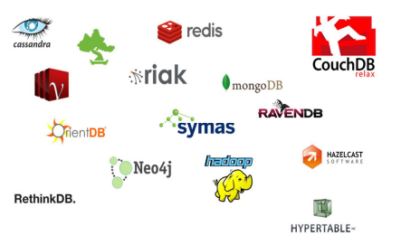

# Introducing NoSQL Databases
## The NoSQL class
The term **NoSQL** emerged in the late 90s, initially coined by **Carlo Strozzi** to describe a different type of technology. Originally interpreted as **Not Only SQL**, it hinted at a **departure** from the rigid structures of **traditional relational databases** (RDBMS). However, the term **lacks a precise definition**, and its accidental nature was acknowledged when it first surfaced at an informal meetup in San Francisco in 2009. <br>

**NoSQL databases** are described as **next-generation**, **non-relational**, **distributed**, **open-source**, and **horizontally scalable** solutions. Common characteristics include being **schema-free**, supporting **easy replication**, having a **simple API**, offering eventual **consistency** (BASE - not ACID), and accommodating vast amounts of data. Despite the ambiguous origins of the term, it now commonly signifies **Not only SQL**.

**Is it just another temporary trend?** Various trends, such as **object databases** and **XML databases**, have surfaced before, but NoSQL databases distinguish themselves by **addressing real, practical problems** faced by major companies. These solutions often originate from significant industry players outside academia, drawing on solid theoretical foundations, particularly in distributed processing.

NoSQL databases are widely used, providing a solution to the **impedance mismatch**<sub><a>[4]</a></sub> of RDBMS. They offer a response to the challenge of saving **complex data structures** in databases, such as the example of a programming language user object, where traditional approaches like object-oriented databases and object-relational mapping frameworks have faced limitations or faded into obscurity.

## Impedance mismatch
The **impedance mismatch** refers to the **disparity between the way data is represented in two different environments**, particularly evident in the contrast between the representation of data in a programming language and a relational database.

In the context of a **programming language**, data may be structured within objects, and to store or transfer this data, it often needs to be **converted** into a format suitable for storage or transmission, such as **JSON** or **XML**. This serialization process introduces a potential mismatch when attempting to interact with a relational database.

**Relational databases**, on the other hand, represent data in the form of tuples or tables. This representation is **fundamentally different** from the object-oriented structure commonly found in programming languages. As a result, **transitioning data** between these two environments can be challenging due to the inherent mismatch in their data models.

For example, how do I save the following **user** object in a database?<sub><a id="impedance-mismatch-ref" href=#impedance-mismatch>[4]</a></sub>

```json
    { "id" : 1234,
        "name" : {

        "first" : "foo",
        "last" : "bar"

        },
    "topics": [ "skating", "music"]
    }
```

**NoSQL databases** address the impedance mismatch by providing a **more flexible** and **adaptable** approach to data representation. They commonly use formats like JSON, which is not only a natural fit for representing complex data structures but is also widely compatible with various programming languages. This compatibility helps bridge the gap between the data representation in the application layer and the storage layer, mitigating the impedance mismatch problem encountered in traditional relational databases.

## NoSQL Datastores
The NoSQL ecosystem comprises over 220 databases, categorized into several families:
- Key-value stores;
- Document stores;
- Wide column stores;
- Graph databases.

<div style="text-align:center">
    
    <p>Some NoSQL databases.</p>
</div>

The **diversity** in these families reflects the adaptability of NoSQL databases to different data storage and retrieval requirements. To check the ranking of DBMSs, refer to this <a href="https://db-engines.com/en/ranking">website</a>.

## NoSQL Properties in more detail
As noted before, NoSQL databases boast **distinct features** that redefine **data management practices**, emphasizing adaptability, efficiency, and cost-effectiveness.

1. **Flexible Scalability**:<br>
NoSQL databases prioritize horizontal scalability, opting for distributed systems that add servers or nodes to accommodate increased capacity and performance. This horizontal scaling approach stands in contrast to vertical scalability, which involves adding resources to a single server. The emphasis on horizontal scalability enables NoSQL databases to seamlessly manage growing data volumes and escalating workloads.

2. **Dynamic Schema of Data**:<br>
A standout feature of NoSQL databases is the dynamic schema of data. Unlike traditional relational databases with rigid, predefined structures, NoSQL databases offer varying levels of flexibility. Each type of NoSQL database presents unique approaches to schema design, catering to diverse application needs. This adaptability proves particularly advantageous in scenarios where data structures evolve or exhibit significant variations across different segments of the database.

3. **Efficient Reading**:<br>
Efficiency in reading operations is a paramount focus for NoSQL databases. While investing more time in data storage, these databases optimize read speed by strategically organizing relevant information. This minimizes the need for complex joins or extensive processing during retrieval, making NoSQL databases well-suited for applications with high read-intensive workloads.

4. **Cost Saving**:<br>
Designed with cost-saving principles, NoSQL databases operate efficiently on commodity hardware. This is a departure from traditional relational databases that often necessitate expensive, high-performance infrastructure for optimal operation. The cost-saving aspect is further bolstered by the widespread adoption of open-source models in NoSQL databases. Many NoSQL systems are available as open-source software, delivering cost-effective solutions without compromising performance or scalability. This openness encourages collaborative development and ensures accessibility within a broader community of users.


## The challenges of NoSQL databases

Nonetheless, an increasing number of companies are embracing NoSQL databases, acknowledging their strengths despite certain weaknesses. NoSQL technologies are frequently employed as **secondary databases** for specific **data processing** needs. For examples of companies using NoSQL databases, refer to the following links:
- <a href="https://www.mongodb.com/who-uses-mongodb">Who uses mongodb</a>
- <a href="http://neo4j.com/customers/">Neo4j - customers</a>

So, **does the rise of NoSQL databases signal the end of relational databases?** Not necessarily. The relational model remains ideal for applications requiring structured data and continues to be the predominant model. Therefore, adopting a **polyglot persistence approach** is feasible, where different data stores are used in different circumstances. Two **prevailing trends** are noteworthy:
- NoSQL databases incorporating relational features.
- RDBMSs are integrating NoSQL principles.

## Data models in the NoSQL family
A data model serves as an abstract representation that defines and organizes the structure and relationships of data, acting as a blueprint for how data elements are stored and retrieved within a system.

NoSQL databases come in various forms, each with its own data model:
- **Document stores**: Data is stored as self-contained documents, similar to JSON or XML files, allowing for flexible schema and easy integration of diverse data structures.
- **Key-value stores**: Data is stored as key-value pairs, offering fast retrieval based on the unique key.
- **Wide-column stores**: Data is stored in column families, where each column can have different properties and data types.
- **Graph databases**: Data is represented as nodes and edges, allowing efficient modeling of relationships between entities.


## Aggregate orientation
In the realm of **data management**, traditional **Relational Database Management Systems (RDBMS)** operate on individual **tuples**, producing results in a **tuple format**. However, the evolving needs of modern applications demand a more **sophisticated approach** to handling data, one that goes beyond the **constraints** of individual tuples.

This shift in perspective is encapsulated in the concept of **aggregate orientation**. In contemporary applications and **NoSQL databases**, data is treated as **cohesive units or aggregates** rather than isolated tuples. **Aggregate orientation** signifies a paradigm where **complex and multifaceted** data is viewed and managed as integrated entities, recognizing the intricate relationships within datasets.

This approach acknowledges that real-world data often comes in **complex structures** that are better represented and processed as cohesive entities. **Aggregates**, in this context, become the **building blocks**, offering a more **flexible** and holistic way to manage data. This concept finds resonance across various NoSQL database types, including **key-value**, **wide-column**, and **document-oriented** datastores, where the handling of aggregates aligns with the diverse and dynamic nature of modern data.

## Design strategy
When it comes to designing databases, there's **no one-size-fits-all solution**. The optimal approach depends entirely on **how you intend to manipulate data**. Here, we explore a design strategy that offers flexibility and efficiency in different scenarios.

There is **no universal answer** to the question of **database design**. It hinges entirely on the nature of data manipulation required for a particular application. However, a thoughtful strategy can enhance performance and meet specific application needs.

In designing a database, **two common solutions** often arise:

1. **Accesses to a Single Order at a Time**: Optimal for scenarios where detailed information about individual orders is frequently required.

2. **Accesses to Customers with All Orders**: Suitable for applications that demand comprehensive access to customer information along with their associated orders.

The **choice between the two solutions** is often context-specific. Some applications may lean towards one approach over the other, even within the confines of a single system. The key is to align the design strategy with the specific requirements and patterns of data usage within the application.

An **alternative design strategy** revolves around adopting an aggregate-oriented approach. This involves grouping related data together to be manipulated as a cohesive unit. Here are the pros and cons of this strategy:
- **Pros**
    - **Cluster Efficiency**: Aggregate-oriented design aligns well with running on a cluster. Grouping data together ensures that it resides on the same node, facilitating efficient manipulation.
- **Cons**
    - **Selective Interactions**: While an aggregate structure may optimize certain data interactions, it can pose challenges for others. The cohesive nature of aggregates may be advantageous in specific scenarios but could be an obstacle in situations where more granular access to data is required.

In conclusion, the choice between different design strategies involves careful consideration of the specific needs of the application, balancing advantages and disadvantages to achieve optimal performance and functionality.

## Notes
<p id="impedance-mismatch"><a href=#impedance-mismatch-ref>[4]</a> As of 2024, some relational databases support JSON as a data type, e.g. <b>PostgreSQL</b>. Nevertheless, the concept of impedance mismatch remains the same: if the presented data were stored in, say, a Java object, how would one proceed to store it in a relational database?</p>