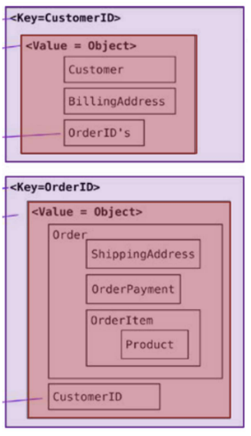
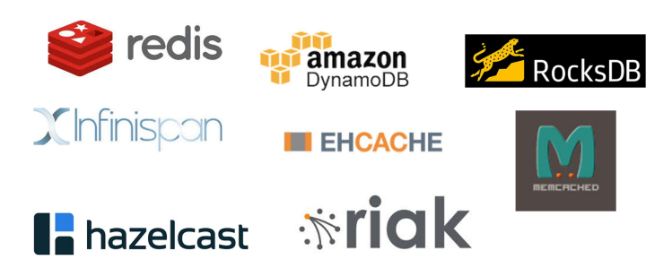

# Introducing Key-Value Stores

## Key-Value Stores: A different approach to Data Storage
Key-value stores offer a powerful and straightforward approach to data storage, fundamentally different from the structure of relational databases. They are strongly aggregate-oriented, meaning they excel at storing and managing complex data structures as single entities. Imagine a key-value store as a giant dictionary, where each entry consists of a unique key and an associated value.

The key acts as an identifier, similar to a word in a dictionary that allows you to pinpoint a specific definition. In contrast to relational databases with rows and columns, the value in a key-value store represents a complete data entity, often referred to as an "aggregate." This aggregate can be any complex data structure – a JSON object, an XML document, or even an image. The key-value store itself treats these aggregates as opaque entities, essentially large blobs of data that it doesn't interpret internally.

Accessing this data is refreshingly simple. You simply provide the key associated with the desired aggregate, and the store retrieves the entire data structure for you. This focus on key-based lookups makes key-value stores ideal for scenarios where fast retrieval of complete data entities is critical.

    
    
An example of key-value representation

If we translated the image into JSON, we would obtain:

For a better understanding, we can compare a key-value store to a simple table in a relational database. Imagine a table with only two columns:
- **ID Column**: This acts as our unique key, similar to a primary key in a relational database.
- **Data Column**: This column stores the actual value, which can be any type of data – again, treated as a large unformatted blob.

The fundamental operations for interacting with key-value stores are equally straightforward:
- **Put**: This operation adds a new key-value pair to the store.
- **Get**: This operation retrieves the value associated with a specific key.
- **Delete**: This operation removes a specific key-value pair from the store.

For large-scale deployments, key-value stores often leverage a distributed hash table (DHT) architecture. This essentially distributes data across a network of computers, each acting as a node. Each node is responsible for managing a specific set of keys and their corresponding values. When data needs to be retrieved, a hashing function is used to create a unique identifier for the key. This identifier then directs the system to the specific node responsible for that particular key, ensuring efficient retrieval.

The core design principle of key-value stores is simplicity. This focus translates to several advantages:
- **Excellent Performance**: Direct key-based access allows for fast retrieval of data.
- **Scalability**: The distributed nature of DHT architectures enables key-value stores to grow seamlessly as data volumes increase.
- **Ease of Use**: The fundamental operations (put, get, delete) are straightforward to understand and implement.

In conclusion, key-value stores offer a compelling alternative for specific data storage needs. Their simplicity, performance, and scalability make them valuable tools in today's data-driven world. By understanding the core concepts of keys, values, aggregates, and basic operations, you can leverage the power of key-value stores to effectively manage your data.
#

    
    
Representatives of the key-value realm

