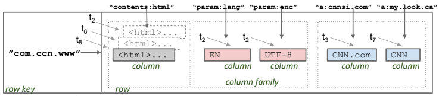

# Exploring Bigtable - A Pioneer in Column-Family Stores

## Introduction to Bigtable
Google's publication on the **Bigtable paper** in 2008 marked a milestone in the realm of distributed data storage systems. At its core, Bigtable is described as a **sparse, distributed, persistent, multi-dimensional sorted map indexed by (row_key, column_key, timestamp)**. This succint definition encapsulates the foundational principles that underpin Bigtable's design and functionality.

## Understanding the Structure: Row Key and Column Families
In the context of Bigtable, data is organized into rows, each identified by a unique row key. Notably, the row key often represents a reversed URL, reflecting Bigtable's origins in web-scale application. Within each row, data is further structured into column families, delineating groups of related data columns. Consider the example of the **com.ccn.www** column family within Bigtable:

    
    

- Contents Column Family: This column family encapsulates the page contents, storing the substantive data associated with the web page.
- Anchor Column Family: In contrast, the anchor column family contains textual references to the page, particularly from other web pages. For instance, the row corresponding to CNN's home page may contain columns named "anchor:cnnsi.com" and "anchor:my.look.ca", indicating references from Sports Illustrated and MY-look home pages, respectively.

## Operational Dynamics
**Multi-Dimensional Sorted Map**  
Bigtable's indexing mechanism, based on the tuple (row_key, column_key, timestamp), facilitates efficient data retrieval and manipulation. The inclusion of timestamps enables versioning of the data, allowing multiple versions of a cell to coexist within the system.

**Sparse and Distributed Nature**  
One of Bigtable's defining characteristics is its ability to handle massive datasets efficiently. By virtue of its sparse and distributed architecture, Bigtable can accomodate vast amounts of data across multiple nodes in a distributed environment, ensuring scalability and fault tolerance.

## Conclusion
In the landscape of column-family stors, Bigtable stands as a seminal example, embodying the principles of scalability, flexibility, and efficiency. Through its innovative design and operational prowess, Bigtable has laid the groundwork for subsequent generations of distributed data storage systems, leaving an indelible mark on the field of database technology. As organizations continue to grapple with the challenges of managing ever-expanding volumes of data, Bigtable remains a beacon of inspiration, guiding the quest for robust, scalable solutions in the digital age.