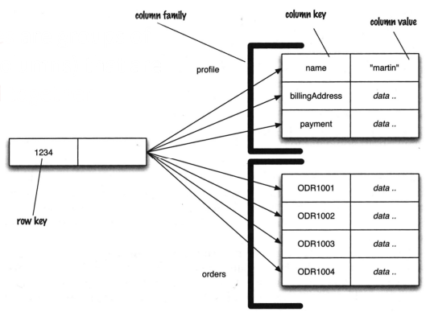

# Column Family Stores

## Structure and Data Model
Column family stores are strongly aggregate-oriented, meaning that data is organized around aggregates, each identified by a key. An aggregate, in this context, is a collection of related data that is often accessed together. At the core of the data model lies a two-level map structure:
1. **Ropw-Key Aggregate Pairs:** Data is stored as a set of pairs, where each pair consists of a row key and its corresponding aggregate.
2. **Column-Key Value Pairs within Aggregates:** Within each aggregate, data is organized into pairs of column keys and their associated values.

This structure provides a flexible way to model data, allowing for efficient access to both entire rows and specific columns within those rows. Additionally, columns can be organized into families, which are groups of columns that are typically accessed together due to their relatedness.

## Operational Characteristics
Accessing data in a column family store involves two primary operations:
1. **Accessing the Row as a Whole:** This operation retrieves the entire aggregate associated with a given row key.
2. **Picking out a particular Column:** Alternatively, users can retrieve specific columns by specifying their column keys within a row.

Each column acts as a unit for access, and while columns must belong to a single column family, rows can have vastly different sets of columns. This flexibility allows for the modeling of diverse data structures, including lists of items where each item is represented as a separate column.

## Example and Perspectives
To illustrate the concept further, consider an example from Sadalage & Fowler's book **NoSQL Distilled** (2012). In this example:
- Column families represent groups of related data columns that are frequently accessed together.
- Operaions enable the retrieval of specific columns, such as retrieving the **name** column associated with a particular row key (**1234**).

<div style="text-align:center">
    
</div>

In understanding column family stores, two perspectives are crucial:
1. **Row-Oriented View:** Here, each row serves as an aggregate, with column families representing meaningful chunks of data with that aggregate.
2. **Column-Oriented View:** Alternatively, each column family defines a distinct record type, and rows are seen as the combination of records from all column families.

This dual perspective underlines the versatility of column family stores, offering users multiple ways to conceptualize and interact with their data.

## Key Points
- **Definition of Aggregates:** In aggregate-oriented databases, data is organized into aggregates, which are collections of related data treated as single units. This approach simplifies transaction management by ensuring that operations are applied consistently within the defined boundaries of aggregates, maintaining data integrity.
- **Storage Management:** Aggregates optimize data storage and retrieval by grouping related data together. This organization enhances performance, particularly over clusters, as accessing data within a single aggregate is typically faster and more efficient than retrieving scattered data from various locations.
- **Data Interaction:** ACID properties are crucial for maintaining data consistency. By defining aggregates as the units for ACID operations, databases ensure that changes to data are reliably applied within the specified boundaries, reducing the risk of data corruption or inconsistency.

## Relationship
- **Aggregates Interaction:** Relationships between aggregates are managed by embedding aggregate IDs within related data. This facilitates efficient retrieval and linking of associated information, simplifying data retrieval and reducing the need for complex join operations, ultimately enhancing query performance.
- **Programmatic Join:**  While the database remains unaware of relationships between aggregates, developers can implement logic to manage these relationships effectively. This separation of concerns between data storage and application logic provides flexibility and allows for tailored relationship management based on specific application requirements.
As an example, consider the following key-value aggregates:
```json
// in customers
{
    "id":1,
    "name":"Martin",
    "billingAddress":[{"city":"Chicago"}]
}

// in orders
{
    "id":99,
    "customerId":1,
    "orderItems":[
        {
            "productId":27,
            "price":32.45,
            "productName":"NoSQL Distilled",
        }
    ],
    "shippingAddress":[{"city":"Chicago"}],
    "orderPayment":[
        {
            "ccinfo":"1000-1000-1000-1000",
            "txnId":"abelift879rft",
            "billingAddress": {"city":"Chicago"}
        }
    ]
}
```
We can observe that the relationship between the two aggregates is represented by the **customer's id**: `customers.id = orders.customerId`.

## Relationship Management
- **Visibility in NoSQL Databases:** NoSQL databases offer mechanisms to enhance relationship visibility. For example, document stores utilize indexing to facilitate efficient querying based on relationships, while databases like Riak provide features for storing relationship metadata, enabling faster retrieval and analysis.
- **Handling Updates:** Aggregate-oriented databases prioritize transactional consistency within each aggregate, with updates treated at the aggregate level. However, ensuring consistency across multiple aggregates during updates becomes the responsibility of the programmer, requiring careful coordination and error handling.
- **Contrast with RDBMSs:** Unlike aggregate-oriented databases, relational databases offer robust support for transactions spanning multiple rows or tables, ensuring atomicity, consistency, isolation, and durability across complex operations. This makes relational databases well-suited for applications with stringent consistency requirements or extensive data relationships.