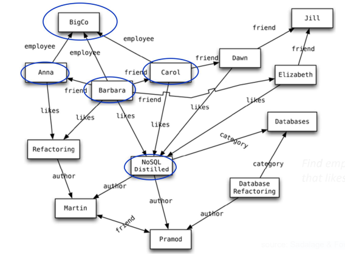
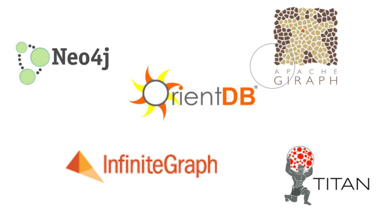

# Graph Databases

## Introduction
In the realm of database management, the frustration with complex relationships and the cumbersome joins inherent in relational databases has spurred the evolution of a new paradigm: **graph databases**. These databases are designed with a singular goal in mind - to model data with intricate relationships as interconnected graphs, offering a more intuitive and efficient approach to data representation and querying.

## Motivation and Goal
The motivation behind graph databases stems from the recognition that complex relationshipsn necessitate complex join operations in traditional relational databases. The overarching goal is to trascend the limitations of relational models by presenting data as graphs, where entities are depicted as nodes and their relationships as edges. This fundamental shift enables the modelling of intricate real-world scenarios, such as social networks, web data, maps, and networks, with unparalleled flexibility and clarity.

## Core Concepts
These are the core concepts underlying graph databases:
- **Entities and Relationships:** Entities are represented as nodes, each characterized by properties such as name, while relationships between entities are captured as directed edges. These edges carry semantic meaning and are assigned types, such as "likes" or "friend", facilitating nuanced querying and analysis of the data.

- **Organizing Nodes by Relationship:** Nodes within a graph database are organized based on their relationships, empowering users to uncover meaningful patterns and insights. For instance, one might query to find all nodes representing employees of a particular company who have expressed an affinity for a specific book.

Here's an example, where the query finds **the employees of BigCo who like NoSQL Distilled**:

    
    
Source: Sadalage & Fowler: NoSQL Distilled, 2012

## Data Model Variations
While the core characteristic of graph databases involves nodes interconnected by edges, there exist considerable variation in data modelling approaches:
- **Neo4J:** This database stores Java objects as nodes and edges in a schemaless fashion, offering flexibility in data representation.
- **InfiniteGraph:** In constrast, InfiniteGraph stores Java objects as subclasses of built-in types, providing a different approach to data modeling and storage.

    
    
Graph databases representatives

## Querying and Perfomance
Queries in graph databases typically involve navigation through the network of edges, with nodes often indexed by attributes such as ID to facilitate efficient retrieval. Unlike relational databases, where joins can be costly, traversal along relationships in graph databases is inherently cheap, making them ideal for querying highly connected data. This performance advantage comes at the expense of insert speed, as much of the work is shifted from query time to insert time.

## Graph Databases vs Relational Databases
In comparing graph databases with relational counterparts:
- **Relational Databases:** Relationships are implemented using foreign keys, and joins can be expensive, especially for highly connected data.
- **Graph Databases:** Traversal along relationship is efficient, leading to better performance for querying highly interconnected data. This trade-off often favors querying performance over insert speed, making graph databases particularly suitable for scenarios where querying efficient is paramount.

In essence, graph databases represent a paradigm shift in data management, offering a powerful and intuitive means of modeling and querying complex relationships.