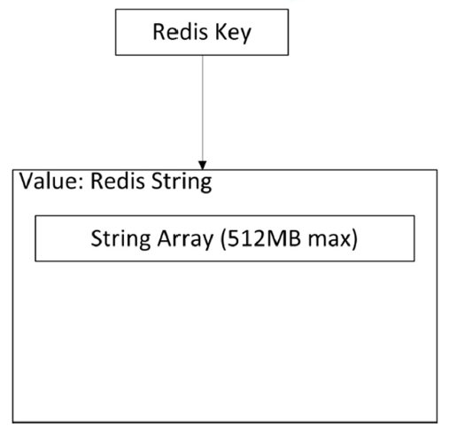
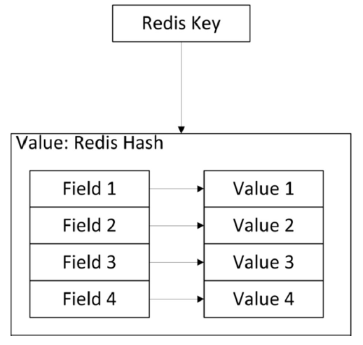
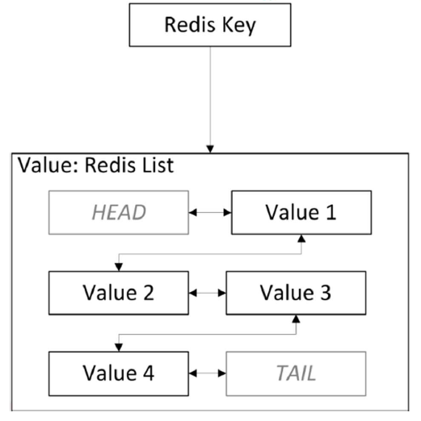
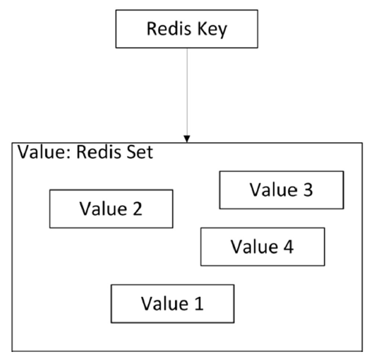
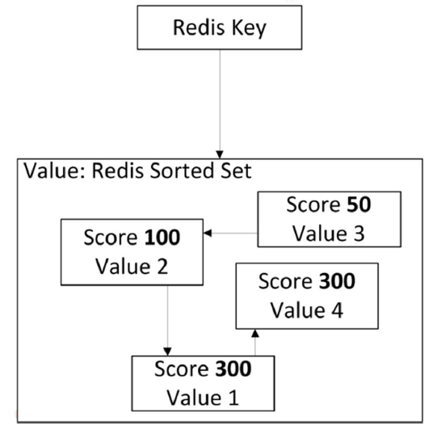

# Introducing Redis

## What is Redis?
Redis (REmote DIctionary Server) is an **in-memory** data store that uses a **key-value data model**. It primarily stores data in memory (RAM) for fast access. However, relying solely on memory introduces a **vulnerability**: data loss upon server restarts. To address this, Redis offers **persistence mechanisms**.

## Memory persistence
There are two persistence mechanisms:
- **Redis Database (RDB)**: this method involves taking **periodic snapshots** of the entire dataset<a id="dataset" href=#dataset-ref>[1]</a> at defined intervals or in response to a certain number of changes. It is possible to configure:
    - **Save frequency**: define the interval between snapshots (e.g., every 5 minutes).
    - **Minimum changes**: set a threshold (e.g., 1000 changes) to trigger a snapshot.

During a RBD snapshot creation, Redis utilizes the `fork()` system call to create a temporary copy of the running process.

This method prioritizes faster restarts, but might result in occasional data loss if the server crashes before a snapshot is captured.

- **Append-Only File (AOF)**: Redis can maintain an append-only file that meticulously logs every operation performed on the data. During a restart the server replays this log to rebuild the in-memory datataset. After the snapshot is prepared
This approach offers superior data durability compared to RDB snapshots, as it guarantees capturing every change. However, it can lead to slightly slower restart times due to the need to process the entire log.

AOF also needs to `fork()` but less frequently and you can tune how often you want to rewrite your logs without any trade-off on durability. AOF also uses the `fsync()` system call. There are different fsync policies:
    - no fsync at all;
    - fsync every second;
    - fsync at every query.
By default, the fsync policy is set to **every second**. 

It is also possible to **disable** persistence completely, which can be used when caching, or combine both AOD and RDB

Choosing the right persistence method involves a **trade-off**: RDB offers **faster restarts** due to loading a single snapshot, while AOF prioritizes **stronger data consistency** by meticulously logging every operation.

It's crucial to remember that, despite the persistence options, Redis remains a primarily in-memory data store, making it ideal for scenarios where speed is paramount.

# RDB: Advantages and Considerations
RDB offers several advantages:
- **Compact backups:** It creates a single file representing a snapshot of your data at a specific time. This makes RDB ideal for backups. You can easily archive hourly backups for the past day and daily backups for a month, allowing you to restore specific versions in case of disasters.
- **Efficient disaster recovery:**  The compact nature of a single file makes RDB well-suited for disaster recovery. You can easily transfer this file to remote data centers or cloud storage like Amazon S3.
- **Performance benefits:** RDB minimizes the impact on the main Redis process. When persisting data, the parent process forks a child process to handle the task. This ensures the main process continues serving clients without performing disk operations.
- **Faster restarts:** RDB generally enables faster restarts compared to AOF (Append-only File) for large datasets due to its single file structure.
- **Partial resynchronization on replicas:** RDB allows partial resynchronizations on replicas after restarts or failovers, minimizing data transfer.
However, RDB also has limitations:
- **Potential data loss:** While RDB offers save points (e.g., creating backups every 5 minutes or 100 writes), data loss can occur if Redis crashes during the snapshot saving process. This is because only completed snapshots guarantee complete data persistence.
- **Impact of forking:** Creating snapshots requires the process to fork, which can be time-consuming for large datasets. This can cause Redis to briefly pause serving clients (milliseconds to a second in extreme cases) depending on dataset size and system resources. AOF also uses forking, but less frequently, and the frequency of rewriting logs can be adjusted without compromising data durability.

# AOF: Durability and Trade-offs
AOF offers superior data durability compared to RDB:
- **Flexible fsync policies:** You can fine-tune data persistence with various fsync settings. Even with the default one-second fsync interval, write performance remains excellent. Fsync operates in the background, allowing the main process to prioritize writes when possible. This limits potential data loss to a maximum of one second's worth of writes.
- **High resilience:** AOF's append-only nature eliminates risks of seeking or data corruption during power outages. Even partially written commands due to disk issues can be repaired using the redis-check-aof tool.
- **Automatic background rewrites:** AOF automatically compacts the log file in the background when it grows excessively. This safe process involves creating a new file containing the minimal set of operations required to rebuild the dataset. Once complete, Redis seamlessly switches to the new file for ongoing writes.
- **Human-readable log:** AOF stores commands in a clear, easy-to-understand format, facilitating parsing and data export. Even in case of accidental data deletion using FLUSHALL, you can potentially recover your dataset by stopping the server, removing the last command from the AOF file, and restarting Redis, provided no log rewrite occurred in the meantime.

AOF Considerations:
- **Larger file size:** AOF files typically occupy more space compared to their RDB counterparts for the same dataset.
- **Potential performance impact:** Depending on the fsync policy, AOF might exhibit slower performance than RDB. While the default setting maintains high performance, disabling fsync entirely matches RDB's speed under heavy workloads. However, RDB offers more predictable maximum latency guarantees during high write volumes.

# Logical Data Model
The key components for Redis' key-value data model are:
- **Keys:** These uniquely identify data entries.
- **Values:** The actual data associated with each key.

The main value types are:
- **Primitives:** Basic data types like strings.
    

    
    

- **Containers:** Collections of strings, such as string lists.
    - **Hashes:** Key-value pairs within a single value.
        

        
        

    - **Lists:** Ordered sequences of values.
        

        
        

    - **Sets:** Unordered collections of unique values.
        

        
        

    - **Sorted Sets:** Ordered sets with ranking capabilities.
        

        
        

# Selection operators
A list of selection operators for the presented data types follows:
- **String - O(1):**
    - **GET** key
    - **SET** key value
    - **EXISTS** key
    - **DEL** key
    - **SETNX** key value: set if not exists.
    - **GETSET** key value: get old value, set new.

- **Hash:**
    - **O(1):**
        - **HGET** key field
        - **HSET** key field value
        - **HEXISTS** key field
        - **HDEL** key field
    - **O(N):**
        - **HMGET** key f1 [f2 ...]: get fields of a hash.
        - **KKEYS** key | HVALS key: all key-value pairs of a hash.

- **Set:**
    - **O(1):**
        - **SADD**, **SREM**, **SCARD**
        - **SPOP** key: return random member of the set.
    - **O(N):**
        - **SDIFF** key1 key2
        - **SUNION** key1 key2
    - **O(C*M):**
        - **SINTER** key1 key2 ...

- **Sorted Set:**
    - **O(1):**
        - **ZCARD** key
    - **O(log(N)):**
        - **ZADD** key score member
        - **ZREM** key member
        - **ZRANK** key member
    - **O(log(N)+M):**
        - **ZRANGE** key start stop (index)
        - **ZRANGEBYSCORE** key min max (score)

- **List:**
    - **O(1):**
        - **LLEN** key
        - **LPOP** key
        - **RPOP** key
        - **LPUSH** key value_1 [value_2 ... value_n]
        - **RPUSH** key value_1 [value_2 ... value_n] 
    - **O(N):**
        - **LINDEX** key index
        - **LSET** key index value
        - **LINSERT** key **BEFORE** | **AFTER** pivot value
        - **LRANGE** key start stop

## Notes

<a id="dataset-ref" href=#dataset>[1]</a> In the context of Redis, and, more generally, that of key-value data stores, the term <b>dataset</b> refers to the <b>complete collection of key-value pairs</b>, not structured tables as in relational databases.
