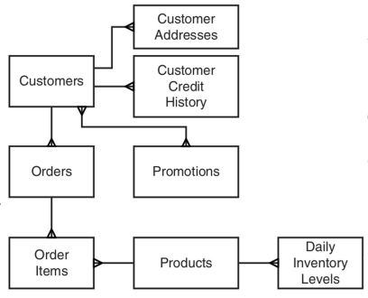
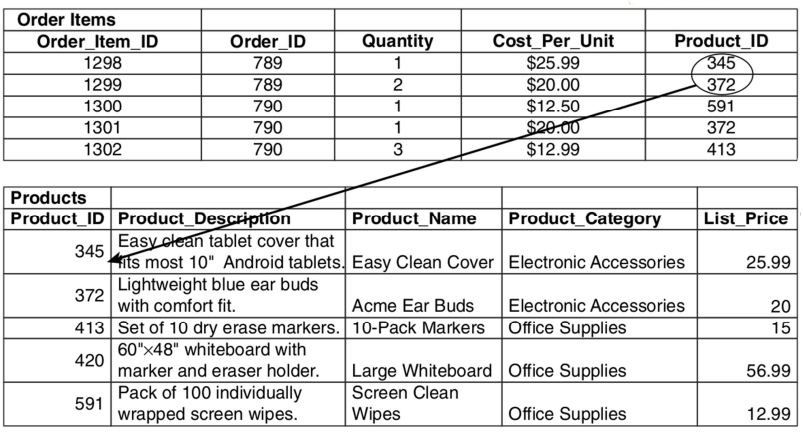

# More on Document Databases

## An Example
Consider an e-commerce platform where we need to manage various type of data, including customer information, 
clickstream data capturing user activity, and the products customers have ordered. For instance, within a 
document collection, we can find a different products: books, CDs and small kitchen appliances. As the 
platform evolves, it's foreseeable that the new types of products will be introduced to meet customer demands and market 
trends.

In particular, any product is characterized by:
- Product name,
- Short description,
- SKU (stock keeping unit),
- Product dimensions,
- Shipping weight,
- Average customer review score,
- Standard price to customer,
- Cost of product from supplier

Each of the product types have specific fields:

|         **BOOK**        |          **CD**         | **Kitchen appliances**  |     
|-------------------------|-------------------------|-------------------------|     
| Author name             | Artist name             | Color                   |    
| Publisher               | Producer name           | Voltage                 |    
| Year of publication     | Number of tracks        | Style                   |     
| Page count              | Total playing time      | Manufacturer name       |     

How do we organize these data in collections?

## Hints from data requirements
Considering the queries tthat customers may make, we need to ensure our database structure accomodates various needs:
1. Determining the average number of products bought by each customer.
2. Finding the minimum and maximum number of products purchased by customers.
3. Identifying the 20 most popular products sorted by customer state.
4. Calculating the average value of sales by customer state, factoring in the difference between the standard price to the customer and the cost of the product from the supplier.
5. Tracking the number of products of different types sold in the last 30 days.
6. Determining how many of each type of product were sold in the last 30 days.

To fulfill all these queries, we require data from all product types. However, query 6. necessitates having a field that 
indicates the product type, so that it's possible to track the sale of each product type separately. It's crucial to 
note that the number of product types can significantly grow over time.

Considering the diverse range of queries that customers may pose, it's practical to store all the products in a single 
collection. This approach ensures that we can efficiently query and analyze data across various product types without needing to manage multiple collections separately. By centralizing all product data in one collection, we streamline data management and simplify query execution, facilitating a more cohesive approach to data analysis.

## No Explicit Schema
Document databases operate without an explicit schema, meaning that each document can differ from all previously inserted documents. Unlike relational databases where a fixed schema is enforced, document databases allow for flexible and dynamic data modeling. This flexibility is advantageous as it eliminates the need for data modelers to specify all possible fields before populating the database. Document databases are often denoted as "schemaless" or with a "polymorphic schema," reflecting their ability to adapt to varying data structures seamlessly.

## Normalization
Normalization, a concept widely used in relational database management systems (RDBMSs), aims to eliminate redundancies and promote data consistency. Redundant data, considered undesirable in normalization, is often the root cause of anomalies within databases. By eliminating redundancy, normalization minimizes the chance of data anomalies occurring, ensuring data integrity and reliability.

    

In a normalized model, entities are represented by boxes, while relationships between entities are depicted by lines. One-to-many relationships, where a single entity is associated with multiple instances of another entity, are illustrated by lines branching out from one entity to several others. For example, in a customer-order relationship, each customer can be associated with multiple orders, leading to a branching line structure. Similarly, many-to-many relationships, where multiple instances of one entity are related to multiple instances of another entity, are depicted by interconnected lines between entities. For instance, customers can have multiple promotions associated with them, and promotions can be linked to multiple customers.

## Join Operations
Join operations address the requirement to work with data from multiple tables within a relational database. 

    

For instance, consider the scenario of listing an order along with all its associated items. To achieve this, attributes from multiple tables need to be included, such as the name of the product, the cost per unit, and the quantity. Join operations enable the combination of data from different tables based on common fields, facilitating the retrieval of comprehensive information for analysis or presentation.

    

